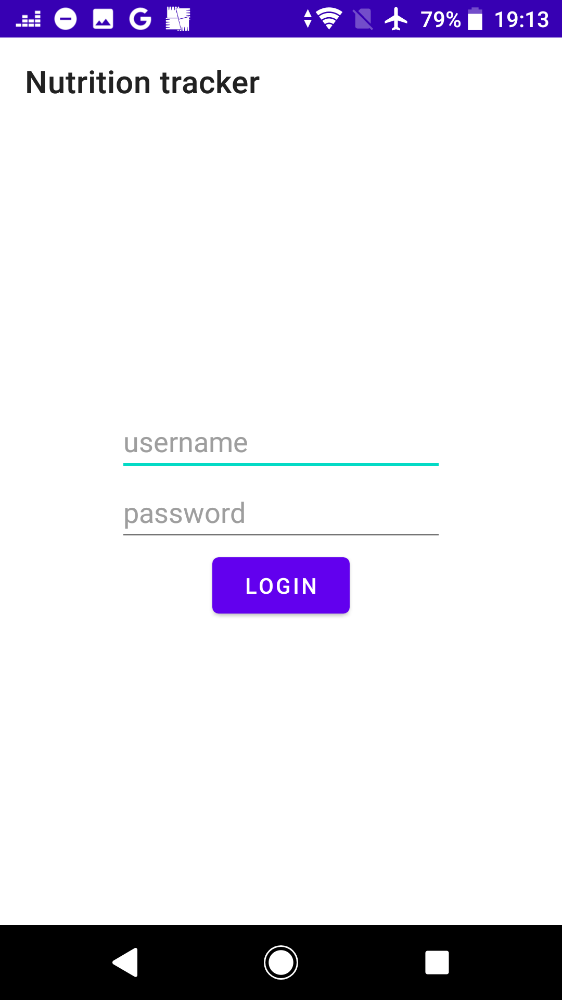
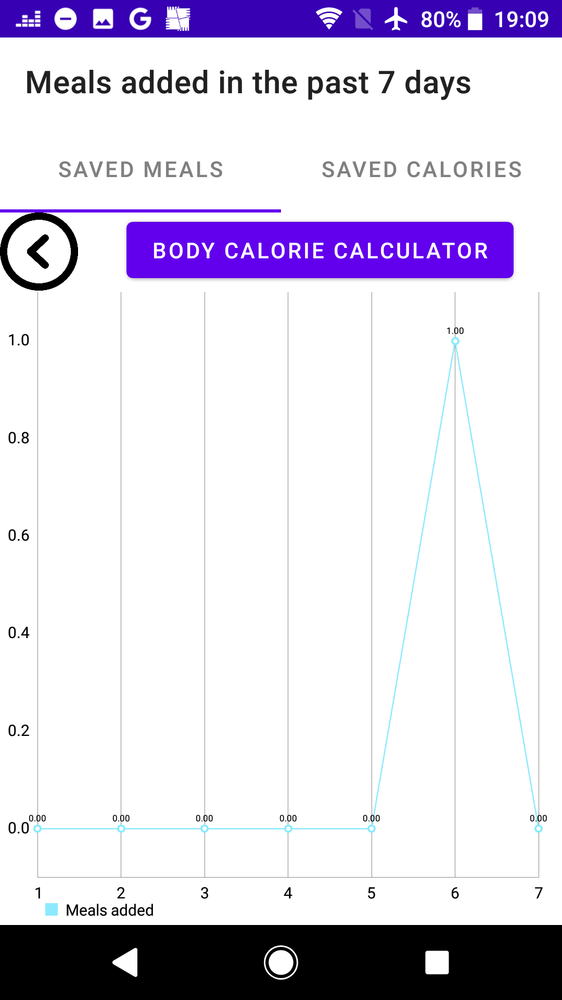

# Nutrition_tracker

# Introduction
This is a University project which was meant to be an android app that helps you decide your meal plan. 
Me and my colleague Milan Marinković worked on this project together. You will find his github here: https://github.com/marinZv 
The original documentation is placed in the "Nutrition tracked.docx" file. 
The app uses two API's, one for the meals: https://themealdb.com/ 
and the other one for fetching the calories for the meals based on their ingredients: https://api-ninjas.com/api/nutrition 
The language used was Kotlin.

# What you can do with the app
You can search meals by categories, name, ingredients, area, tag. 
You can save meals to certain days and see if it exceeds your daily intake. 
You can also calculate your suggested intake based on your height, weight, age, sex and activity level. 
For each meal you can see the detailed screen with ingredients, explanation on how to prepare the meal, 
the amount of calories it has, a link to the youtube video tutorial. 
You can create a weekly plan which can be sent to you via email. 
There is a screen with statistics on how many meals you added for a certain day in the past 7 days, 
and also a page with calories added in the past 7 days.(Parts of graph where the calories of meals added 
exceed the daily intake are colored red) 
There are other functionalities but these are the most important. 

# Libraries used
Retrofit, Koin, Gson

# The app itself

Splash screen:

Login screen:

Meal categories screen:

Categories description:

Meals in a category:

Saved meals:

Detailed meal screen:

Saving a certain meal:

Fetching and sorting meals by calories:

After sorting by calories:

Statistics on added meals:

Statistics on added calories:

Calculate daily intake for yourself:

Filter meals by category, area, ingredient, tag, name:

Create a weekly plan and send it to your email:

